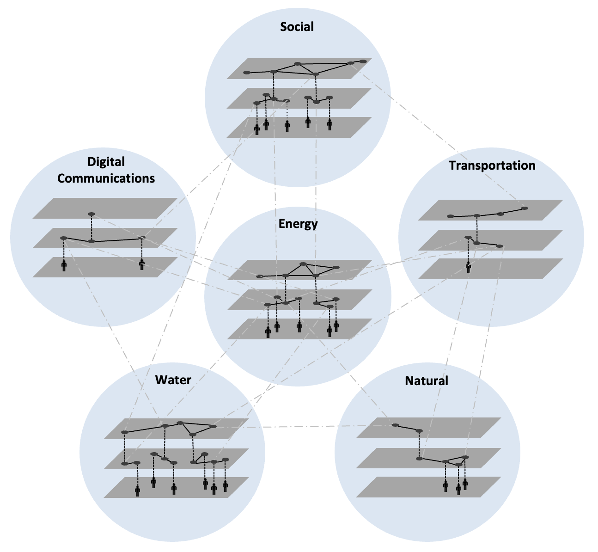

## About us
 

Oxford Infrastructure Analytics (OIA) was founded in 2017 by three academics
from the award-winning Oxford Programme for Sustainable Infrastructure
Systems (OPSIS), based at the University of Oxford.

Our team of experts have been pioneering the development of a new generation
of data, tools, insights and education that have been published in leading
academic journals and are recognised worldwide.

We have added value to a variety of clients from government, industry,
research and the third sector, creating impacts that accelerate the
transition to sustainable and resilient infrastructure globally. 

<!--
## Analytical capabilities

Oxford Infrastructure Analytics has developed a unique set of capabilities for
geospatial analysis of the location, performance and vulnerability of
infrastructure networks.

We achieve this based on in-house and open source tools
and datasets which include:

- Exploiting heterogeneous datasets to construct infrastructure network models;
- Integration of hazard datasets, from natural hazards (including the effects of
  climate change) and security threats;
- Algorithms for analysing the criticality and propagation of infrastructure
  failures through networks;
- Evaluation of the business interruption from network failure, including
  transport rerouting and business downtime;
- Analysis of the wider economic impacts of infrastructure disruption;
- Prioritisation and sequencing of investments to enhance infrastructure network
  resilience.

## Experience and Impacts

Oxford Infrastructure Analytics and its staff have coordinated and contributed
towards a variety of complex studies in various countries and contexts globally.

Our team has been responsible for:

- national-scale climate-change infrastructure risk assessment for China;
- a national-model of interdependent infrastructure in New Zealand for disaster preparedness and proactive resilience building;
- modelling to help prioritize infrastructure adaptation decisions in the coastal zone in Bangladesh;
- infrastructure risk and resilience assessment for the occupied Palestinian
  territories;
- national infrastructure assessment and climate risk assessment for the
  Government of Curaçao and UNOPS;
- flood risk analysis for the United Republic of Tanzania, providing a detailed
  understanding of flood risks to the national multi-modal transport network at
  present and the future

## Our Clients

We work with a variety of clients from government, industry, research and the
third sector. So far, our clients include the Corridors for Growth Multi-donor
Trust Fund, the World Bank, UNOPS, UK Aid, and the UK Environment Agency.
-->
